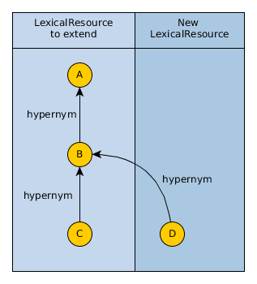
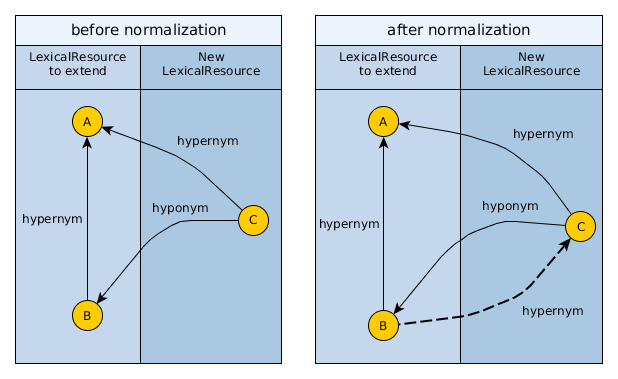

### Introduction

Diversicon supports `LexicalResource` reading, creation by import and some limited form of update. Delete is currently not supported. These operations relay on two principles explained here: 

#### Principle 1: One LexicalResource per XML

As per LMF specs, each LMF XML file contains exactly one `LexicalResource`. This also simplifies file management and provenance.

#### Principle 2: Imported LexicalResources shouldn't change

A Diversicon database should always contain a faithful representation of the imported XMLs. To allow this, eventual changes to an imported `LexicalResource`  should be done in a controlled manner by Diversicon (i.e. ID renaming or edges added for computing transitive closure). This way at any time you should be able to export a `LexicalResource` to obtain something nearly identical to the original XML it came from. Note some difference with the original could be admitted for provenance purposes, like i.e. additional metadata documentating the passage into Diversicon. 

If you still try directly updating an already imported `LexicalResource` (i.e. by manually editing the db), then it becomes your responability to keep the database in a consistent state.

### Create

Creation of `LexicalResource` should be done only through import functions of Diversicon, as this preserves database integrity and allows keeping properly track of metadata.

### Update

There are different scenarios in which a user might want to update an existing `LexicalResource`. He might want to modify internal links, links to other resources, or just change fields such as synset descriptions. We now discuss in detail some relevant case for synsets.

#### Appending synsets to an upper ontology

If you just want to append synsets under existing ones in an upper ontology, without actually modifying that ontology, It is sufficient to create a new `LexicalResource` XML and link synsets of another XML by using `SynsetRelations`:

#### Inserting middle synsets

Suppose you have an upper ontology with two `Synsets` linked by a `hypernym` relation, and you want to extend the relation by inserting a third node between the two:

Currently, to achieve this goal without manually modifying the original resource, you can create a new `LexicalResource` holding the middle synset linked with a `hypernym` (a canonical relation) to the top node, and a `hyponym` (a non-canonical relation) to the bottom node. When importing the new `LexicalResource` Diversicon will automatically run a normalization procedure, which will create edges of canonical relations such as `hypernym`:

#### Updating existing synsets

In some cases you might be forced to directly change the original `LexicalResource`. For example, you found a nice WordNet in your favourite language but quickly discovered some synsets have wrong relations and others don't have any description at all. So you want to fix relations and add missing descriptions: currently the best way to do this would be to create your own version of the `LexicalResource` and assign a different namespace to the resource. To do the changes, you could either do a manual DB edit, edit the original XML or :

##### Updating existing synsets: Manual DB edit

1. modify the original XML to assign a new namespace
2. import the XML into Diversicon
3. do other changes with some [Database browser](http://diversicon-eu.kb/manual/divercli/latest/Tools.html)
4. manually run the function `processGraph` to validate, normalize, and compute the transitive closure of the graph.

To keep track of changes, you could use some DB diff tool

##### Updating existing synsets: Edit original XML

1. modify the original XML to assign a new namespace and do other changes
2. import the modified XML into Diversicon

To keep track of changes, you could use some diff tool, even versioning with git (not ideal especially if 
the XML is huge, but could still work).

### Delete

Currently, there is no special facility for deleting stuff. If you try to do it manually the DB might also complain that you are violating some constraint (for `SynsetRelation` you don't have constraints). Probably in many cases if you need to get rid of a `LexicalResource` you could just create an empty database and reimport all the XMLs.

