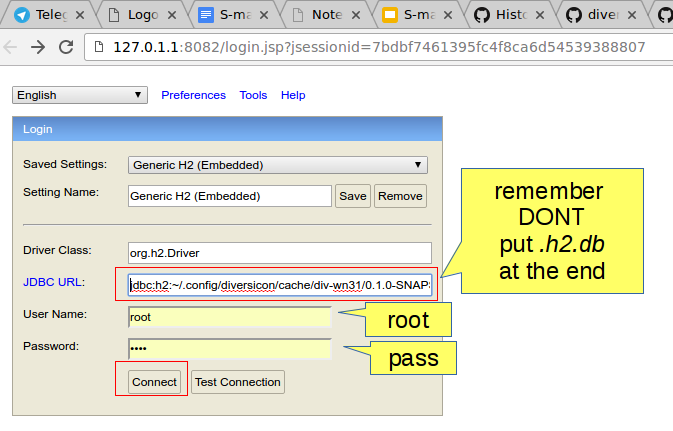

### H2

To browse H2 databases, you can use H2 own browsing tool. First download 
version 1.3.176 [platform independent zip](http://www.h2database.com/h2-2014-04-05.zip). 

unzip and then execute 

On Linux:

```
bin/h2.sh
```

On Windows:

```
bin/h2.bat
```

This should open a browser pointed at a screen like this:


